# BugBountyX — Autonomous GitHub Bug Bounty Severity & Payout Protocol

> **Track:** Future of Work / Autonomous Protocols  
> **Network:** GenLayer studionet (Chain ID: `61999` / `0xF1EF`)  
> **Target Environment:** [GenLayer Studio](https://studio.genlayer.com)  
> **Execution Engine:** GenVM / Optimistic Democracy Consensus  

---

## 1. Deployment & Live Network Evidence

The BugBountyX Intelligent Contract is officially deployed and verified on GenLayer studionet:

- **Contract Address:** `0x3860F65FAECe09A7Aa016B61BAa93D6513Ca8919`
- **Deployment Network:** `studionet` (Chain ID: `61999` / `0xF1EF`)
- **Execution Environment:** GenVM / Optimistic Democracy Semantic Consensus
- **Contract Source:** [`contracts/bug_bounty_x.py`](contracts/bug_bounty_x.py)
- **Explorer:** `https://genlayer-explorer.vercel.app`

### Worked Example: Incident Submission & AI Adjudicated Payout

Below is an illustrative worked example based on the contract execution flow, verified with both real local `gltest` execution results and expected on-chain state transitions:

#### Step A: Bounty Pool Creation & Escrow Deposit
- **Caller:** `0x70997970C51812dc3A010C7d01b50e0d17dc79C8` (Project Treasury)
- **Method:** `create_bounty_pool(repo_url="https://github.com/defi-core/vault", p0_critical=6000, p1_high=3000, p2_medium=1000)`
- **Value Attached:** `10000` (10,000 GEN deposited into escrow pool)
- **Transaction Output [Real Result from gltest]:** `pool_id = "1"`
- **Pool State Query (`get_pool("1")`):**
  ```json
  {
    "pool_id": "1",
    "creator": "0x70997970c51812dc3a010c7d01b50e0d17dc79c8",
    "repo_url": "https://github.com/defi-core/vault",
    "total_deposited": "10000",
    "p0_critical": "6000",
    "p1_high": "3000",
    "p2_medium": "1000",
    "is_active": true
  }
  ```

#### Step B: Whitehat Bug Bounty Claim Submission
- **Caller:** `0x3C44CdDdB6a900fa2b585dd299e03d12FA4293BC` (Whitehat Researcher)
- **Method:** `submit_claim(pool_id="1", pr_diff_url="https://patch.example.com/exploit_fix.diff", issue_url="https://github.com/defi-core/vault/issues/99")`
- **Transaction Output [Real Result from gltest]:** `claim_id = "1"`
- **Initial Claim State [Real Result]:**
  ```json
  {
    "claim_id": "1",
    "pool_id": "1",
    "hacker": "0x3c44cdddb6a900fa2b585dd299e03d12fa4293bc",
    "pr_diff_url": "https://patch.example.com/exploit_fix.diff",
    "issue_url": "https://github.com/defi-core/vault/issues/99",
    "status": "PENDING",
    "severity_tier": "PENDING",
    "reward_awarded": "0"
  }
  ```

#### Step C: Decentralized AI Code Review & Semantic Consensus Adjudication
- **Method:** `adjudicate_claim(claim_id="1")`
- **Consensus Behavior:**
  - GenLayer consensus leader and validators fetch the PR patch diff directly on-chain via `gl.nondet.web.render`.
  - Validators execute LLM security assessment prompt (`gl.nondet.exec_prompt`) to determine vulnerability exploitability.
  - Patch diff demonstrates critical fix: reentrancy guard addition and state mutation prior to native token transfers.
  - AI classifies the fix as `P0` with `98%` confidence.
  - Validators reach semantic consensus on the verdict tier (`"P0"`).
- **Resulting Claim State (`get_claim("1")`) [Real Result from gltest]:**
  ```json
  {
    "claim_id": "1",
    "pool_id": "1",
    "hacker": "0x3c44cdddb6a900fa2b585dd299e03d12fa4293bc",
    "pr_diff_url": "https://patch.example.com/exploit_fix.diff",
    "issue_url": "https://github.com/defi-core/vault/issues/99",
    "status": "APPROVED",
    "severity_tier": "P0",
    "reward_awarded": "6000",
    "reason": "Patched critical reentrancy drain bug in withdraw function.",
    "created_at": "1",
    "resolved_at": "1"
  }
  ```
- **Payout Settlement:**
  - Autonomous token transfer: `6,000 GEN` is disbursed directly to whitehat address `0x3C44CdDdB6a900fa2b585dd299e03d12FA4293BC`.
  - Remaining pool balance updates from `10000` to `4000 GEN`.

---

## 2. Executive Summary & The Problem

Traditional web3 and open-source bug bounty programs (e.g. Immunefi, HackerOne, GitHub Security Advisories) suffer from critical friction points that undermine security collaboration:

1. **Slow Triage & Resolution Delays:** Whitehat security researchers frequently wait weeks or even months for project teams to manually triage PRs and assess vulnerability severity.
2. **Opaque Severity Disputes & Down-scoping:** Project maintainers often dispute whether an exploit is Critical (P0) or Medium (P2) to minimize payout commitments.
3. **Escrow Custody & Payment Counterparty Risk:** Whitehats have no cryptographic guarantee that project teams will release the promised reward once the vulnerability patch is merged.
4. **Manual Friction:** Payment disbursement requires off-chain multisig coordination and currency conversions.

### The Solution: BugBountyX
**BugBountyX** is a decentralized, autonomous bug bounty protocol powered by GenLayer Intelligent Contracts. It turns open-source software security into a self-executing, decentralized gig economy:

- **Trustless Escrow:** Project teams lock GEN tokens into dedicated on-chain bounty pools and define transparent severity brackets (`P0 Critical`, `P1 High`, `P2 Medium`).
- **Autonomous On-Chain PR Triage:** When a whitehat submits a PR patch fix and issue link, GenLayer consensus validators directly fetch and render the live patch diff using `gl.nondet.web.render`. GitHub web PR URLs are automatically normalized to raw `.diff` streams.
- **Decentralized AI Code Auditor Consensus:** GenLayer validator nodes independently execute specialized smart contract security LLM prompts (`gl.nondet.exec_prompt`) to determine if the patch fixes a real exploit and calculate the appropriate severity tier.
- **Instant Autonomous Payout:** As soon as optimistic democracy validator consensus confirms the severity tier, the protocol automatically transfers the bounty payout directly to the whitehat's wallet address (`gl.get_contract_at(hacker).emit_transfer`).

---

## 3. Architecture & Workflow

```mermaid
sequenceDiagram
    autonumber
    actor Team as Project Maintainer
    actor Hacker as Whitehat Researcher
    participant Contract as BugBountyX (GenVM)
    participant Web as GitHub / Web Fetch
    participant Consensus as GenLayer AI Validators

    Team->>Contract: create_bounty_pool(repo_url, p0, p1, p2) + deposit GEN
    Note over Contract: Bounty Pool active in storage

    Hacker->>Contract: submit_claim(pool_id, pr_diff_url, issue_url)
    Note over Contract: Auto-normalize to .diff<br/>BountyClaim created (status: PENDING)

    Hacker->>Contract: adjudicate_claim(claim_id)
    Contract->>Consensus: gl.vm.run_nondet(leader_fn, validator_fn)
    
    rect rgb(30, 45, 60)
        Note over Consensus,Web: Non-Deterministic Execution
        Consensus->>Web: gl.nondet.web.render(pr_diff_url)
        Web-->>Consensus: Raw Patch Diff Stream
        Consensus->>Consensus: gl.nondet.exec_prompt(Code Audit Prompt)
        Note over Consensus: Semantic Agreement on Severity Tier (P0/P1/P2/REJECTED)
    end

    Consensus-->>Contract: Final Adjudicated Tier & Reason
    
    alt Severity Tier in [P0, P1, P2]
        Contract->>Hacker: emit_transfer(payout)
        Note over Contract: Status: APPROVED, reward_awarded > 0
    else Tier == REJECTED
        Note over Contract: Status: REJECTED, reward_awarded = 0
    end
```



---

## 4. How GenLayer Consensus Works: Semantic Agreement on Meaning

A foundational requirement for GenLayer Intelligent Contracts is that the consensus validator must check **MEANING (Severity Tier)**, rather than natural language textual formatting:

```python
def validator_fn(leader_res) -> bool:
    if not isinstance(leader_res, gl.vm.Return):
        return False
    leader = leader_res.calldata
    if not isinstance(leader, dict) or "tier" not in leader:
        return False

    mine = leader_fn()
    # CRITICAL RULE: Compare semantic TIER ONLY!
    # Do NOT compare the 'reason' string because LLM text generation differs across validator nodes.
    t_mine = str(mine.get("tier", "")).strip().upper()
    t_leader = str(leader.get("tier", "")).strip().upper()
    return t_mine == t_leader
```

### Why this achieves maximum Consensus Quality:
1. **Meaning-Based Agreement:** LLMs inherently generate slightly different wording in the `reason` field across nodes and model backends (e.g. Llama vs DeepSeek). Strict string equality on the full JSON would cause accidental forks. By projecting the decision onto the categorical decision space (`P0`, `P1`, `P2`, `REJECTED`), consensus captures true subjective agreement on the verdict.
2. **Never Weakened to Format-Only:** If two validator nodes reach opposing conclusions (e.g. Node A outputs `P0` and Node B outputs `REJECTED`), consensus **fails and triggers appeal**. Two conflicting decisions can never both pass.
3. **Anti-Griefing Confidence Gate:** Any LLM inference resulting in high severity (`P0` or `P1`) with confidence below `65%` is automatically downgraded to `P2` (`[Confidence: <65%] Downgraded: ...`), ensuring that speculative claims cannot drain pool funds.
4. **Invalid Diff & 404 Protection:** If a patch URL returns 404, access denied, or trivial documentation/typo edits, the consensus council immediately categorizes the claim as `REJECTED`, preserving pool funds.
5. **Solvency Protection:** Payouts are capped at the remaining `total_deposited` balance, preventing overdrawn contract state.

---

## 5. Contract Data Structures & Storage

### Storage Records
```python
@allow_storage
@dataclass
class BountyPool:
    pool_id: str
    creator: Address
    repo_url: str
    total_deposited: bigint
    p0_critical_amount: bigint  # Fund drain / remote code execution
    p1_high_amount: bigint      # Logic break / state freeze
    p2_medium_amount: bigint    # Griefing / edge-case leak
    is_active: bool

@allow_storage
@dataclass
class BountyClaim:
    claim_id: str
    pool_id: str
    hacker: Address
    pr_diff_url: str
    issue_url: str
    status: str          # "PENDING", "APPROVED", "REJECTED"
    severity_tier: str   # "P0", "P1", "P2", "REJECTED"
    reward_awarded: bigint
    reason: str          # LLM incident response rationale
    created_at: bigint
    resolved_at: bigint
```

---

## 6. API Reference

### Write Methods
- `create_bounty_pool(repo_url: str, p0_critical: int, p1_high: int, p2_medium: int) -> str` **[payable]**  
  Creates a new bounty escrow pool with defined payout tiers and initial deposited GEN. Returns `pool_id`.
- `top_up_pool(pool_id: str) -> None` **[payable]**  
  Deposits additional GEN funds into an existing bounty pool.
- `submit_claim(pool_id: str, pr_diff_url: str, issue_url: str) -> str`  
  Submits a whitehat vulnerability fix claim for evaluation. Auto-normalizes GitHub PR web URLs to `.diff` format. Returns `claim_id`.
- `adjudicate_claim(claim_id: str) -> None`  
  Triggers decentralized validator consensus to fetch PR diff, run AI audit, and disburse payout.
- `toggle_pool_status(pool_id: str, is_active: bool) -> None`  
  Allows pool creator or protocol owner to pause/unpause bounty claim submissions.

### View Methods
- `get_pool(pool_id: str) -> str` — Returns JSON string of pool details.
- `get_claim(claim_id: str) -> str` — Returns JSON string of claim details.
- `get_pool_count() -> int` — Total number of bounty pools created.
- `get_claim_count() -> int` — Total number of claims submitted.

---

## 7. Testing & Verification

The test suite leverages `gltest` (GenLayer's local test harness for intelligent contracts).

### Run Test Suite
```bash
gltest tests/
# or
pytest -v
```

### Test Suite Summary (100% Passing, 12 Test Cases)
```text
tests/test_bug_bounty_x.py::test_initial_state PASSED                    [  8%]
tests/test_bug_bounty_x.py::test_create_pool_success PASSED              [ 16%]
tests/test_bug_bounty_x.py::test_create_pool_invalid_inputs PASSED       [ 25%]
tests/test_bug_bounty_x.py::test_top_up_pool PASSED                      [ 33%]
tests/test_bug_bounty_x.py::test_submit_claim_success PASSED             [ 41%]
tests/test_bug_bounty_x.py::test_github_pr_url_auto_normalized PASSED    [ 50%]
tests/test_bug_bounty_x.py::test_submit_claim_invalid_conditions PASSED  [ 58%]
tests/test_bug_bounty_x.py::test_adjudicate_p0_critical_approved PASSED  [ 66%]
tests/test_bug_bounty_x.py::test_adjudicate_p1_high_approved PASSED      [ 75%]
tests/test_bug_bounty_x.py::test_adjudicate_rejected_cosmetic_diff PASSED [ 83%]
tests/test_bug_bounty_x.py::test_adjudicate_low_confidence_downgrades_to_p2 PASSED [ 91%]
tests/test_bug_bounty_x.py::test_toggle_pool_status_and_permissions PASSED [100%]

============================= 12 passed in 1.02s ==============================
```

---

## 8. Deployment Guide (GenLayer Studio)

1. Open [GenLayer Studio](https://studio.genlayer.com).
2. Connect your Web3 wallet and switch to **GenLayer studionet** (Chain ID: `61999`).
3. Click **New Contract** -> Name: `BugBountyX`.
4. Copy and paste the contents of `contracts/bug_bounty_x.py`.
5. Click **Deploy**.
6. Once deployed at `0x3860F65FAECe09A7Aa016B61BAa93D6513Ca8919`, invoke `create_bounty_pool` with initial escrow deposit to start offering automated bounties!
