# BugBountyX — Autonomous GitHub Bug Bounty Severity & Payout Protocol

> **Track:** Future of Work / Autonomous Protocols  
> **Network:** GenLayer studionet (Chain ID: `61999` / `0xF1EF`)  
> **Target Environment:** [GenLayer Studio](https://studio.genlayer.com)  
> **Execution Engine:** GenVM / Optimistic Democracy Semantic Consensus  

---

## 1. Deployment & Live Network Evidence

The BugBountyX Intelligent Contract is officially deployed and verified on GenLayer studionet:

- **Contract Address:** `0x90f13C33D0BcB1eD7695D3931EE2C6e64A4d7469`
- **Deployment Network:** `studionet` (Chain ID: `61999` / `0xF1EF`)
- **Execution Environment:** GenVM / Optimistic Democracy Semantic Consensus
- **Contract Source:** [`contracts/bug_bounty_x.py`](contracts/bug_bounty_x.py)
- **Explorer:** [http://explorer-studio.genlayer.com/address/0x90f13C33D0BcB1eD7695D3931EE2C6e64A4d7469](http://explorer-studio.genlayer.com/address/0x90f13C33D0BcB1eD7695D3931EE2C6e64A4d7469)

### Worked Example: Incident Submission & AI Adjudicated Payout

Below is an illustrative worked example based on the contract execution flow, verified with both real local `gltest` execution results and expected on-chain state transitions:

#### Step A: Bounty Pool Creation & Escrow Deposit
- **Caller:** `0x70997970C51812dc3A010C7d01b50e0d17dc79C8` (Project Treasury)
- **Method:** `create_bounty_pool(repo_url="https://github.com/defi-protocol/core-contracts", p0_critical=6000, p1_high=3000, p2_medium=1000)`
- **Security Validation:** Contract strictly parses and validates canonical host (`github.com`) and extracts `repo_owner = "defi-protocol"`, `repo_name = "core-contracts"`.
- **Value Attached:** `10000` (10,000 GEN deposited into escrow pool)
- **Transaction Output [Real Result from gltest]:** `pool_id = "1"`
- **Pool State Query (`get_pool("1")`):**
  ```json
  {
    "pool_id": "1",
    "creator": "0x70997970c51812dc3a010c7d01b50e0d17dc79c8",
    "repo_url": "https://github.com/defi-protocol/core-contracts",
    "repo_owner": "defi-protocol",
    "repo_name": "core-contracts",
    "total_deposited": "10000",
    "p0_critical": "6000",
    "p1_high": "3000",
    "p2_medium": "1000",
    "is_active": true
  }
  ```

#### Step B: Whitehat Bug Bounty Claim Submission (Canonical Identity Validation)
- **Caller:** `0x3C44CdDdB6a900fa2b585dd299e03d12FA4293BC` (Whitehat Researcher)
- **Method:** `submit_claim(pool_id="1", pr_diff_url="https://github.com/defi-protocol/core-contracts/pull/99", issue_url="https://github.com/defi-protocol/core-contracts/issues/99")`
- **Security Validations Enforced:**
  - **Canonical Host Validation:** Host is verified to be strictly `github.com` (rejects unrelated hosts attempting slug-in-path or query bypasses).
  - **Canonical Repository Binding:** Validates that PR and Issue belong strictly to `defi-protocol/core-contracts`.
  - **Canonical Pull Request Identity:** Extracts `pr_number = 99`. All aliases (`.diff`, `.patch`, `/`, `?params`) collapse into the exact same canonical identity `defi-protocol/core-contracts#PR-99`.
  - **Persistent Replay Protection:** Checks that PR #99 is not already pending and has not previously received a payout. Sets pending lock.
  - **Contract-Acquired Evidence URLs:** Generates canonical URLs `https://github.com/defi-protocol/core-contracts/pull/99.diff` and `https://github.com/defi-protocol/core-contracts/issues/99`.
- **Transaction Output [Real Result from gltest]:** `claim_id = "1"`
- **Initial Claim State [Real Result]:**
  ```json
  {
    "claim_id": "1",
    "pool_id": "1",
    "hacker": "0x3c44cdddb6a900fa2b585dd299e03d12fa4293bc",
    "pr_number": 99,
    "issue_number": 99,
    "pr_diff_url": "https://github.com/defi-protocol/core-contracts/pull/99.diff",
    "issue_url": "https://github.com/defi-protocol/core-contracts/issues/99",
    "status": "PENDING",
    "severity_tier": "PENDING",
    "reward_awarded": "0"
  }
  ```

#### Step C: Decentralized AI Code Review & Semantic Consensus Adjudication
- **Method:** `adjudicate_claim(claim_id="1")`
- **Consensus Behavior:**
  - Validators fetch BOTH the contract-constructed canonical PR patch diff and Issue security context on-chain via `gl.nondet.web.render`.
  - Validators execute LLM security assessment prompt (`gl.nondet.exec_prompt`) evaluating the full untruncated code patch against the full verified issue description.
  - Patch diff demonstrates critical fix: reentrancy guard addition and state mutation prior to native token transfers.
  - AI classifies the fix as `P0` with `98%` confidence.
  - Validators reach semantic consensus on the verdict tier (`"P0"`).
- **Resulting Claim State (`get_claim("1")`) [Real Result from gltest]:**
  ```json
  {
    "claim_id": "1",
    "pool_id": "1",
    "hacker": "0x3c44cdddb6a900fa2b585dd299e03d12fa4293bc",
    "pr_number": 99,
    "issue_number": 99,
    "pr_diff_url": "https://github.com/defi-protocol/core-contracts/pull/99.diff",
    "issue_url": "https://github.com/defi-protocol/core-contracts/issues/99",
    "status": "APPROVED",
    "severity_tier": "P0",
    "reward_awarded": "6000",
    "reason": "Patched critical reentrancy drain bug in withdraw function.",
    "created_at": "1",
    "resolved_at": "1"
  }
  ```
- **Payout & Replay Lockout:**
  - Safe native token transfer: `6,000 GEN` is disbursed directly to whitehat address using `_Recipient(claim.hacker).emit_transfer` (safeguarded against EOA wallet failures).
  - Remaining pool balance updates from `10000` to `4000 GEN`.
  - Canonical PR `defi-protocol/core-contracts:PR-99` is permanently recorded in `claimed_patches`. Any subsequent attempt to claim PR #99 using `.patch`, `.diff`, or any other alias is immediately rejected.

---

## 2. Core Security Architecture & Replay Protection

### A. Canonical Host & Repository Validation
Traditional string matching (e.g. `repo_slug in url`) is vulnerable to host spoofing where an attacker serves an arbitrary diff from `https://evil.com/github.com/owner/repo/pull/1.diff`. BugBountyX enforces strict canonical URL parsing:
1. **Host Verification:** Validates that the hostname is strictly `github.com` or `www.github.com`.
2. **Repository Namespace Extraction:** Validates that the URL path matches `/ <repo_owner> / <repo_name> / pull / <pr_number>`.

### B. Canonical PR Identity & Anti-Alias Replay Protection
GitHub allows pull requests to be viewed and fetched under multiple aliases:
- Web: `https://github.com/owner/repo/pull/42`
- Trailing slash: `https://github.com/owner/repo/pull/42/`
- Diff stream: `https://github.com/owner/repo/pull/42.diff`
- Patch stream: `https://github.com/owner/repo/pull/42.patch`
- Query parameters: `https://github.com/owner/repo/pull/42?tab=files`

BugBountyX strips all extensions and collapses any alias into its exact integer identity: `pr_number = 42`.
The replay key is bound strictly to `f"{pool.repo_owner}/{pool.repo_name}:PR-{pr_number}"`.
- **Race Condition Prevention:** Submitting PR #42 while a claim is pending is rejected.
- **Double Payout Prevention:** Once PR #42 receives a payout, all aliases are permanently locked out from ever receiving another payout.

### C. Contract-Acquired Evidence
Rather than trusting the whitehat's submitted URL for data fetching, the contract directly synthesizes the canonical fetch URLs:
- `canonical_diff_url = f"https://github.com/{owner}/{repo}/pull/{pr_number}.diff"`
- `canonical_issue_url = f"https://github.com/{owner}/{repo}/issues/{issue_number}"`
Validators fetch strictly from these canonical endpoints via `gl.nondet.web.render`.

---

## 3. Architecture & Workflow

```mermaid
sequenceDiagram
    autonumber
    actor Team as Project Maintainer
    actor Hacker as Whitehat Researcher
    participant Contract as BugBountyX (GenVM)
    participant Web as GitHub Canonical Endpoints
    participant Consensus as GenLayer AI Validators

    Team->>Contract: create_bounty_pool(repo_url, p0, p1, p2) + deposit GEN
    Note over Contract: Validate Host github.com<br/>Extract canonical repo_owner & repo_name

    Hacker->>Contract: submit_claim(pool_id, pr_url, issue_url)
    Note over Contract: Parse Canonical Host & Path<br/>Extract canonical pr_number & issue_number<br/>Enforce Replay Key: owner/repo:PR-{number}<br/>Synthesize Canonical URLs

    Hacker->>Contract: adjudicate_claim(claim_id)
    Contract->>Consensus: gl.vm.run_nondet(leader_fn, validator_fn)
    
    rect rgb(30, 45, 60)
        Note over Consensus,Web: Non-Deterministic Execution
        Consensus->>Web: gl.nondet.web.render(canonical_diff_url)
        Web-->>Consensus: Full Untruncated Diff Stream
        Consensus->>Web: gl.nondet.web.render(canonical_issue_url)
        Web-->>Consensus: Full Untruncated Issue Content
        Consensus->>Consensus: gl.nondet.exec_prompt(Diff + Issue Audit)
        Note over Consensus: Semantic Agreement on Severity Tier (P0/P1/P2/REJECTED)
    end

    Consensus-->>Contract: Final Adjudicated Tier & Reason
    
    alt Severity Tier in [P0, P1, P2]
        Contract->>Hacker: _Recipient.emit_transfer(payout)
        Note over Contract: claimed_patches[canonical_key] = True (Permanent Lock)<br/>pending_patches[canonical_key] = False<br/>Status: APPROVED, reward_awarded > 0
    else Tier == REJECTED
        Note over Contract: pending_patches[canonical_key] = False<br/>Status: REJECTED, reward_awarded = 0
    end
```



---

## 4. How GenLayer Consensus Works: Semantic Agreement on Meaning

The consensus validator enforces agreement on **MEANING (Severity Tier)**, rather than natural language textual formatting:

```python
def validator_fn(leader_res) -> bool:
    if not isinstance(leader_res, gl.vm.Return):
        return False
    leader = leader_res.calldata
    if not isinstance(leader, dict) or "tier" not in leader:
        return False

    mine = leader_fn()
    # CRITICAL RULE: Compare semantic TIER ONLY!
    # Ignore natural language variation in the 'reason' field across validator nodes.
    t_mine = str(mine.get("tier", "")).strip().upper()
    t_leader = str(leader.get("tier", "")).strip().upper()
    return t_mine == t_leader
```

### Why this achieves maximum Consensus Quality:
1. **Meaning-Based Agreement:** LLMs produce natural variations in explanations across validator nodes. Strict string matching on JSON text causes accidental forks. Semantic agreement isolates the categorical decision (`P0`, `P1`, `P2`, `REJECTED`).
2. **Never Weakened to Format-Only:** Conflicting decisions (e.g. `P0` vs `REJECTED`) fail consensus immediately.
3. **Full Evidence Integrity:** No truncation (`[:3500]`) is applied; full diff and issue text are analyzed.
4. **Anti-Griefing Confidence Gate:** Any LLM inference resulting in high severity (`P0` or `P1`) with confidence below `65%` is automatically downgraded to `P2`.
5. **Solvency Protection:** Payouts are capped at the remaining `total_deposited` balance, preventing overdrawn contract state.

---

## 5. Contract Data Structures & Storage

```python
@allow_storage
@dataclass
class BountyPool:
    pool_id: str
    creator: Address
    repo_url: str
    repo_owner: str
    repo_name: str
    total_deposited: bigint
    p0_critical_amount: bigint  # Fund drain / remote code execution
    p1_high_amount: bigint      # Logic break / state freeze
    p2_medium_amount: bigint    # Griefing / edge-case leak
    is_active: bool

@allow_storage
@dataclass
class BountyClaim:
    claim_id: str
    pool_id: str
    hacker: Address
    pr_number: bigint
    issue_number: bigint
    pr_diff_url: str
    issue_url: str
    status: str          # "PENDING", "APPROVED", "REJECTED"
    severity_tier: str   # "P0", "P1", "P2", "REJECTED"
    reward_awarded: bigint
    reason: str          # LLM incident response rationale
    created_at: bigint
    resolved_at: bigint
```

---

## 6. API Reference

### Write Methods
- `create_bounty_pool(repo_url: str, p0_critical: int, p1_high: int, p2_medium: int) -> str` **[payable]**  
  Creates a new bounty escrow pool with defined payout tiers. Validates host (`github.com`) and extracts canonical `repo_owner` and `repo_name`. Returns `pool_id`.
- `top_up_pool(pool_id: str) -> None` **[payable]**  
  Deposits additional GEN funds into an existing bounty pool.
- `submit_claim(pool_id: str, pr_diff_url: str, issue_url: str) -> str`  
  Submits a whitehat vulnerability fix claim. Parses canonical host, repository, and integer PR number. Collapses all aliases (`.diff`, `.patch`, `/`), enforces replay protection, and synthesizes canonical fetch URLs. Returns `claim_id`.
- `adjudicate_claim(claim_id: str) -> None`  
  Triggers decentralized validator consensus to fetch PR diff and Issue context from canonical URLs, execute untruncated AI code audit, disburse safe native payout, and permanently lock approved PR against replay.
- `toggle_pool_status(pool_id: str, is_active: bool) -> None`  
  Allows pool creator or protocol owner to pause/unpause bounty claim submissions.

### View Methods
- `get_pool(pool_id: str) -> str` — Returns JSON string of pool details including `repo_owner` and `repo_name`.
- `get_claim(claim_id: str) -> str` — Returns JSON string of claim details including `pr_number` and `issue_number`.
- `is_pr_claimed(repo_owner: str, repo_name: str, pr_number: int) -> bool` — Check if a canonical PR has already received a payout.
- `is_pr_pending(repo_owner: str, repo_name: str, pr_number: int) -> bool` — Check if a canonical PR is currently pending adjudication.
- `is_patch_claimed(pool_id: str, pr_diff_url: str) -> bool` — Helper to check if a PR URL has received payout.
- `is_patch_pending(pool_id: str, pr_diff_url: str) -> bool` — Helper to check if a PR URL is pending adjudication.
- `get_pool_count() -> int` — Total number of bounty pools created.
- `get_claim_count() -> int` — Total number of claims submitted.

---

## 7. Testing & Verification

The test suite leverages `gltest` (GenLayer's local test harness for intelligent contracts).

### Run Test Suite
```bash
gltest tests/
# or
pytest -v
```

### Test Suite Summary (100% Passing, 14 Comprehensive Tests)
```text
tests/test_bug_bounty_x.py::test_initial_state PASSED                    [  7%]
tests/test_bug_bounty_x.py::test_create_pool_success PASSED              [ 14%]
tests/test_bug_bounty_x.py::test_create_pool_invalid_inputs PASSED       [ 21%]
tests/test_bug_bounty_x.py::test_top_up_pool PASSED                      [ 28%]
tests/test_bug_bounty_x.py::test_submit_claim_success PASSED             [ 35%]
tests/test_bug_bounty_x.py::test_unrelated_host_bypass_blocked PASSED    [ 42%]
tests/test_bug_bounty_x.py::test_repository_binding_rejects_foreign_repo PASSED [ 50%]
tests/test_bug_bounty_x.py::test_alias_replay_attack_completely_blocked PASSED [ 57%]
tests/test_bug_bounty_x.py::test_adjudicate_p0_critical_approved_and_alias_payout_lockout PASSED [ 64%]
tests/test_bug_bounty_x.py::test_adjudicate_p1_high_approved PASSED      [ 71%]
tests/test_bug_bounty_x.py::test_adjudicate_rejected_cosmetic_diff PASSED [ 78%]
tests/test_bug_bounty_x.py::test_adjudicate_rejected_if_issue_404 PASSED [ 85%]
tests/test_bug_bounty_x.py::test_adjudicate_low_confidence_downgrades_to_p2 PASSED [ 92%]
tests/test_bug_bounty_x.py::test_toggle_pool_status_and_permissions PASSED [100%]

============================= 14 passed in 1.67s ==============================
```

---

## 8. Deployment Guide (GenLayer Studio)

1. Open [GenLayer Studio](https://studio.genlayer.com).
2. Connect your Web3 wallet and switch to **GenLayer studionet** (Chain ID: `61999`).
3. Click **New Contract** -> Name: `BugBountyX`.
4. Copy and paste the contents of `contracts/bug_bounty_x.py`.
5. Click **Deploy**.
6. Once deployed, invoke `create_bounty_pool` with initial escrow deposit to start offering automated bounties!
